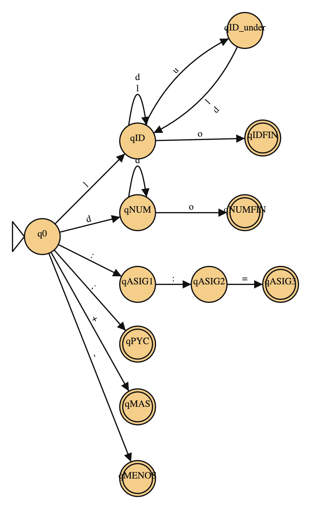

# Resolución Parcial UNAHUR Parseo y Generación de Código - Mayo 2026
* **ALUMNO**: Toloza, Tomás
* **DNI**: 41897633

Lenguaje BRA. Cadena de estudio: `começo A ::= BB - 34 + A; final`

## 1. Análisis léxico (scanner)

El scanner toma como entrada el código fuente del programa BRA y entrega al parser los tokens reconocidos. 

Para la cadena de trabajo:

```
começo A ::= BB - 34 + A; final
```

el scanner debe reconocer las palabras reservadas `começo` y `final`, los identificadores `A` y `BB`, la constante `34`, el operador de asignación `::=`, los operadores `+` y `-`, y el separador `;`.

### 1.1 Definiciones (token, lexema, patrón)

Definiciones del documento de scanner adaptadas a BRA. 

La convención de nombres usada en todo este documento es: los lexemas literales (`começo`, `final`, `ler`, `escrever`, `::=`, `+`, `-`, `;`, `(`, `)`, `,`) son a la vez el nombre del token; sólo `ID` y `NUM` se nombran con un identificador simbólico porque agrupan infinitos lexemas.

- Token o componente léxico en BRA: `começo`, `final`, `ler`, `escrever`, ID, NUM, `::=`, `+`, `-`, `;`, `(`, `)`, `,`.
- Lexema en BRA: lexema `BB` para el token ID; lexema `34` para el token NUM.
- Patrón en BRA, el patrón de ID es `[a-zA-Z] ([a-zA-Z] | [0-9])* (_ ([a-zA-Z] | [0-9]) ([a-zA-Z] | [0-9])*)*`

### 1.2 Catálogo de tokens de BRA

| Token      | Lexema(s) | Descripción                                                                      |
|------------|-----------|----------------------------------------------------------------------------------|
| `começo`   | começo    | Palabra reservada que abre el bloque                                             |
| `final`    | final     | Palabra reservada que cierra el bloque                                           |
| `ler`      | ler       | Palabra reservada de entrada                                                     |
| `escrever` | escrever  | Palabra reservada de salida                                                      |
| ID         | A, BB     | Identificador (letra inicial, hasta 4 caracteres, sin terminar en `_`, sin `__`) |
| NUM        | 34        | Constante entera                                                                 |
| `::=`      | ::=       | Operador de asignación                                                           |
| `+`        | +         | Operador suma                                                                    |
| `-`        | -         | Operador resta                                                                   |
| `(`        | (         | Paréntesis izquierdo                                                             |
| `)`        | )         | Paréntesis derecho                                                               |
| `,`        | ,         | Separador de listas                                                              |
| `;`        | ;         | Fin de sentencia                                                                 |

### 1.3 Patrones (ER) por token

```
começo   = "começo"
final    = "final"
ler      = "ler"
escrever = "escrever"
ID       = [a-zA-Z] ([a-zA-Z] | [0-9])* (_ ([a-zA-Z] | [0-9]) ([a-zA-Z] | [0-9])*)*
NUM      = [0-9]+
::=      = "::="
+        = "+"
-        = "-"
;        = ";"
(        = "("
)        = ")"
,        = ","
```

### 1.4 Diagrama de transiciones (DT)



### 1.5 Tabla de transiciones

| Q          | letra   | dígito | _         | :       | =       | +       | -       | ;       | (       | )       | ,       | otro    | Token | Retroceso |
|------------|---------|--------|-----------|---------|---------|---------|---------|---------|---------|---------|---------|---------|-------|-----------|
| >q0        | qID     | qNUM   | Error     | qASIG1  | Error   | qMAS    | qMENOS  | qPYC    | qPARI   | qPARD   | qCOMA   | Error   | -     | -         |
| qID        | qID     | qID    | qID_under | qIDFIN  | qIDFIN  | qIDFIN  | qIDFIN  | qIDFIN  | qIDFIN  | qIDFIN  | qIDFIN  | qIDFIN  | -     | -         |
| qID_under  | qID     | qID    | Error     | Error   | Error   | Error   | Error   | Error   | Error   | Error   | Error   | Error   | -     | -         |
| *qIDFIN    | -       | -      | -         | -       | -       | -       | -       | -       | -       | -       | -       | -       | ID    | 1         |
| qNUM       | qNUMFIN | qNUM   | qNUMFIN   | qNUMFIN | qNUMFIN | qNUMFIN | qNUMFIN | qNUMFIN | qNUMFIN | qNUMFIN | qNUMFIN | qNUMFIN | -     | -         |
| *qNUMFIN   | -       | -      | -         | -       | -       | -       | -       | -       | -       | -       | -       | -       | NUM   | 1         |
| qASIG1     | Error   | Error  | Error     | qASIG2  | Error   | Error   | Error   | Error   | Error   | Error   | Error   | Error   | -     | -         |
| qASIG2     | Error   | Error  | Error     | Error   | qASIG3  | Error   | Error   | Error   | Error   | Error   | Error   | Error   | -     | -         |
| *qASIG3    | -       | -      | -         | -       | -       | -       | -       | -       | -       | -       | -       | -       | `::=` | 0         |
| *qPYC      | -       | -      | -         | -       | -       | -       | -       | -       | -       | -       | -       | -       | `;`   | 0         |
| *qMAS      | -       | -      | -         | -       | -       | -       | -       | -       | -       | -       | -       | -       | `+`   | 0         |
| *qMENOS    | -       | -      | -         | -       | -       | -       | -       | -       | -       | -       | -       | -       | `-`   | 0         |
| *qPARI     | -       | -      | -         | -       | -       | -       | -       | -       | -       | -       | -       | -       | `(`   | 0         |
| *qPARD     | -       | -      | -         | -       | -       | -       | -       | -       | -       | -       | -       | -       | `)`   | 0         |
| *qCOMA     | -       | -      | -         | -       | -       | -       | -       | -       | -       | -       | -       | -       | `,`   | 0         |

## 2. GIC y derivaciones

### 2.1 Producciones de la GIC

```
S  -> começo B final
B  -> A | A B
A  -> ID ::= E ;
   |  ler ( L ) ;
   |  escrever ( M ) ;
L  -> ID | ID , L
M  -> E | E , M
E  -> E + T | E - T | T
T  -> ID | NUM | ( E )
```

### 2.2 Tokenización de la cadena de estudio

Cadena fuente:

```
começo A ::= BB - 34 + A; final
```

Lexemas reconocidos por el Scanner, en orden:

| Lexema | Token  |
|--------|--------|
| começo | começo |
| A      | ID     |
| ::=    | ::=    |
| BB     | ID     |
| -      | -      |
| 34     | NUM    |
| +      | +      |
| A      | ID     |
| ;      | ;      |
| final  | final  |

Cadena de tokens que recibe el Parser:

```
começo ID ::= ID - NUM + ID ; final
```

### 2.3 Árbol de Análisis Sintáctico

Como la GIC no es ambigua (ver 2.4), tanto la derivación por izquierda como la derivación por derecha de la cadena `começo A ::= BB - 34 + A; final` producen el mismo árbol. Las dos estrategias difieren sólo en el orden temporal en que expanden los nodos (pre-orden por izquierda vs pre-orden por derecha), pero la estructura final es única.

```
                  S
              /   |   \
          começo  B  final
                  |
                  A
              / /  \ \
            ID ::=  E  ;
            |       |
           (A)    / | \
                 E  +  T
               / | \   |
              E  -  T  ID
              |     |  |
              T   NUM (A)
              |    |
             ID  (34)
              |
             (BB)
```

---

## 3. Análisis Sintáctico Descendente con Retroceso (ASDB)

Entrada tokenizada: começo ID(A) ::= ID(BB) - NUM(34) + ID(A) ; final.

| Pila                | Entrada                                           | Transición                         |
|---------------------|---------------------------------------------------|------------------------------------|
| λ                   | começo ID(A) ::= ID(BB) - NUM(34) + ID(A) ; final | δ(q0, λ, λ) = (q1, #)              |
| #                   | começo ID(A) ::= ID(BB) - NUM(34) + ID(A) ; final | δ(q1, λ, λ) = (q2, S)              |
| #S                  | começo ID(A) ::= ID(BB) - NUM(34) + ID(A) ; final | δ(q2, λ, S) = (q2, final B começo) |
| #final B começo     | começo ID(A) ::= ID(BB) - NUM(34) + ID(A) ; final | δ(q2, começo, começo) = (q2, λ)    |
| #final B            | ID(A) ::= ID(BB) - NUM(34) + ID(A) ; final        | δ(q2, λ, B) = (q2, A)              |
| #final A            | ID(A) ::= ID(BB) - NUM(34) + ID(A) ; final        | δ(q2, λ, A) = (q2, ; E ::= ID)     |
| #final ; E ::= ID   | ID(A) ::= ID(BB) - NUM(34) + ID(A) ; final        | δ(q2, ID, ID) = (q2, λ)            |
| #final ; E ::=      | ::= ID(BB) - NUM(34) + ID(A) ; final              | δ(q2, ::=, ::=) = (q2, λ)          |
| #final ; E          | ID(BB) - NUM(34) + ID(A) ; final                  | δ(q2, λ, E) = (q2, T + E)          |
| #final ; T + E      | ID(BB) - NUM(34) + ID(A) ; final                  | δ(q2, λ, E) = (q2, T - E)          |
| #final ; T + T - E  | ID(BB) - NUM(34) + ID(A) ; final                  | δ(q2, λ, E) = (q2, T)              |
| #final ; T + T - T  | ID(BB) - NUM(34) + ID(A) ; final                  | δ(q2, λ, T) = (q2, ID)             |
| #final ; T + T - ID | ID(BB) - NUM(34) + ID(A) ; final                  | δ(q2, ID, ID) = (q2, λ)            |
| #final ; T + T -    | - NUM(34) + ID(A) ; final                         | δ(q2, -, -) = (q2, λ)              |
| #final ; T + T      | NUM(34) + ID(A) ; final                           | δ(q2, λ, T) = (q2, NUM)            |
| #final ; T + NUM    | NUM(34) + ID(A) ; final                           | δ(q2, NUM, NUM) = (q2, λ)          |
| #final ; T +        | + ID(A) ; final                                   | δ(q2, +, +) = (q2, λ)              |
| #final ; T          | ID(A) ; final                                     | δ(q2, λ, T) = (q2, ID)             |
| #final ; ID         | ID(A) ; final                                     | δ(q2, ID, ID) = (q2, λ)            |
| #final ;            | ; final                                           | δ(q2, ;, ;) = (q2, λ)              |
| #final              | final                                             | δ(q2, final, final) = (q2, λ)      |
| #                   | λ                                                 | δ(q2, λ, #) = (q3, λ)              |
| λ                   | λ                                                 | accept                             |

## 4. Análisis Sintáctico Ascendente con Retroceso (ASAB)

Entrada tokenizada: começo ID(A) ::= ID(BB) - NUM(34) + ID(A) ; final.

| Pila                            | Entrada                                            | Transición            |
|---------------------------------|----------------------------------------------------|-----------------------|
| λ                               | começo ID(A) ::= ID(BB) - NUM(34) + ID(A) ; final  | δ(q0, λ, λ) = (q1, #) |
| #                               | começo ID(A) ::= ID(BB) - NUM(34) + ID(A) ; final  | shift                 |
| # começo                        | ID(A) ::= ID(BB) - NUM(34) + ID(A) ; final         | shift                 |
| # começo ID(A)                  | ::= ID(BB) - NUM(34) + ID(A) ; final               | shift                 |
| # começo ID(A) ::=              | ID(BB) - NUM(34) + ID(A) ; final                   | shift                 |
| # começo ID(A) ::= ID(BB)       | - NUM(34) + ID(A) ; final                          | reduce                |
| # começo ID(A) ::= T            | - NUM(34) + ID(A) ; final                          | reduce                |
| # começo ID(A) ::= E            | - NUM(34) + ID(A) ; final                          | shift                 |
| # começo ID(A) ::= E -          | NUM(34) + ID(A) ; final                            | shift                 |
| # começo ID(A) ::= E - NUM(34)  | + ID(A) ; final                                    | reduce                |
| # começo ID(A) ::= E - T        | + ID(A) ; final                                    | reduce                |
| # começo ID(A) ::= E            | + ID(A) ; final                                    | shift                 |
| # começo ID(A) ::= E +          | ID(A) ; final                                      | shift                 |
| # começo ID(A) ::= E + ID(A)    | ; final                                            | reduce                |
| # começo ID(A) ::= E + T        | ; final                                            | reduce                |
| # começo ID(A) ::= E            | ; final                                            | shift                 |
| # começo ID(A) ::= E ;          | final                                              | reduce                |
| # começo A                      | final                                              | reduce                |
| # começo B                      | final                                              | shift                 |
| # começo B final                | λ                                                  | reduce                |
| # S                             | λ                                                  | δ(q1, λ, S) = (q2, λ) |
| #                               | λ                                                  | δ(q2, λ, #) = (q3, λ) |
| λ                               | λ                                                  | accept                |
